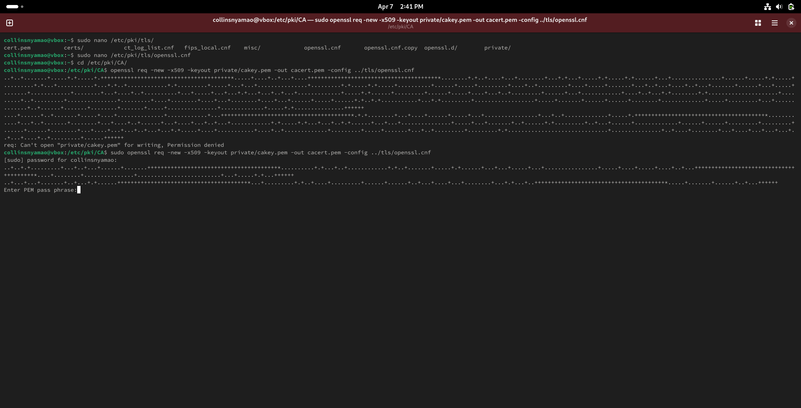

# 🎓 Implementing Digital Certificates with OpenSSL & Apache

---

## Slide 1: Introduction

**Objective:**
Understand and demonstrate how digital certificates and Certificate Authorities work using OpenSSL and Apache.

---

## Slide 2: Fedora Apache Test Page

This shows Apache is installed and running properly on Fedora.

---

## Slide 3: Installing OpenSSL

Install OpenSSL to enable certificate generation.

---

## Slide 4: Verifying Web Server is Running

Use `systemctl` to enable and start the Apache HTTP server.

---

## Slide 5: CA Directory Structure

Create the folder structure used by the Certificate Authority (CA) and initialize it.

---

## Slide 6: Editing openssl.cnf

Customize OpenSSL configuration to reflect CA and request policies.

---

## Slide 7: Creating the CA Certificate

This generates a self-signed certificate for the CA.

---

## Slide 8: Providing Certificate Information

Details like organization, common name, and email are entered here.

---

## Slide 9: Verifying Apache Status

Confirm that Apache is running successfully.

---

## Slide 10: Importing Certificate in Firefox

Import your CA certificate into Firefox to trust your local server.

---

## Slide 11: Conclusion

- Set up a CA and signed certificates
- Configured Apache to use them
- Verified secure connection with Firefox

This forms the foundation of web-based trust and encryption!
